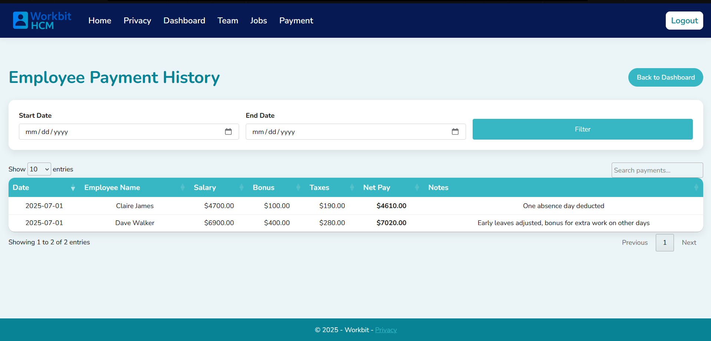

# Workbit HCM

Workbit HCM is a **Human Capital Management (HCM) platform** built with ASP.NET Core MVC.  
It helps organizations manage employees, departments, payroll, attendance, and budgets, with **role-based dashboards for CEOs, Managers, Employees, and Admins**.

---

## Features
- **Role-specific dashboards** for each user type.
- **Attendance tracking** with filters by role and date.
- **Payroll management** with salaries, bonuses, and taxes.
- **Department budgeting** with allocation and tracking.
- **Custom error pages** (403, 404, 500) for better UX.
- **Responsive UI** using Bootstrap 5.

---

## Database Schema


### Tables Overview
- **ApplicationUser** – Base user with identity authentication.
- **Ceo, Manager, Employee** – Role-specific profile tables linked to ApplicationUser.
- **AttendanceEntry** – Tracks check-ins and check-outs.
- **Payment** – Stores salary, bonuses, and tax deductions.
- **Company & Department** – Defines the organizational structure.
- **Job & DepartmentBudget** – Job assignments and budget allocations.

---

## Screenshots

### Home & Authentication
   
 

### CEO Dashboard & Modules
   
 

### Manager & Employee Modules
   
   
 

### Admin Panel & Payment History
 

### Error Pages
   


---

## Installation

1. **Clone Repository**
```bash
git clone https://github.com/your-repo/workbit-hcm.git
cd workbit-hcm
```

2. **Setup Database**
- Update connection string in `appsettings.json`.
- Apply migrations:
```bash
dotnet ef database update
```

3. **Run Application**
```bash
dotnet run
```

The app will run at `http://localhost:5000`.

---

## Technologies
- **ASP.NET Core MVC**
- **Entity Framework Core**
- **SQL Server**
- **Bootstrap 5**
- **Identity Authentication**

---

## License
Licensed under the MIT License. See the `LICENSE` file for more information.
